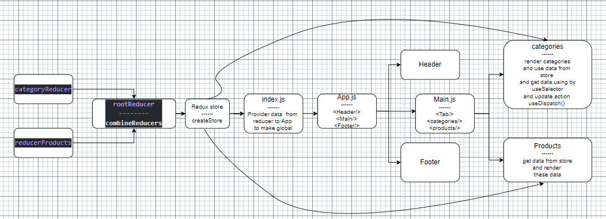

## Uml

## Phase_1

* user/developer stories detail the major functionality for this phase of the project.

* As a user, I expect to see a list of available product categories in the store so that I can easily browse products
* As a user, I want to choose a category and see a list of all available products matching that category
* As a user, I want a clean, easy to use user interface so that I can shop the online store with confidence

|Name|Link|
|---|---|
|website|[storeFront](https://mujahed-abuarob-store-2022.netlify.app/)|
|PR_1|[PR](https://github.com/Mujahedyousef/store_front/pull/3)|
----

## Phase_2

* New user stories to meet the new requirements.

* As a user, I want to choose from products in the list and add them to my shopping cart
* As a user, I want to see the products that I’ve added to my shopping cart so that
* As a user, I want to change the quantity of items I intend to purchase in my shopping cart
* As a user, I want to be able to remove an item from my shopping cart
